<h1 align="center">
NERP EMAIL INTEGRATION

USER&#39;S GUIDE
</h1>

1. **Introduction:**

NERP Email Integration will utilize the built-in incoming server in Odoo to convert incoming emails from Gmail accounts into opportunities or leads in CRM app in Odoo. This module will fetch emails which had been labeled in Gmail mailbox.

Gmail Integration creates an access to user Gmail accounts and fetches emails in users&#39; mailbox through IMAP mail server.

Email Integration will detect emails from same senders&#39; address and merge them together into one lead in CRM. That will be also true for sending emails. All sending or replying-to emails will be merged into the same receivers&#39; email addresses.

Email Integration app will automatically fetch emails every 5 minutes for emails have been sent or received within 1 day.

2. **Requirements:**

Odoo instance version 13.0  
Gmail accounts with proper setup and password

3. **Getting started:**
   1. **Configuration in Gmail Account:**

      1. **Setup security and IMAP access:**
         
         Login into a Gmail account and navigate to Manage your Google Account setting
         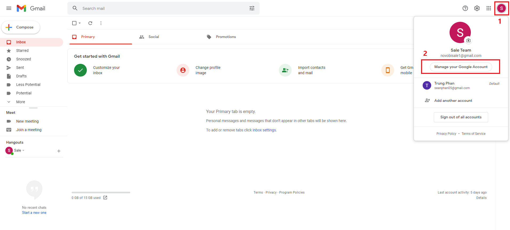

         Select Security tab. On the right-hand side, scroll down to Less secure app access section. Click on Turn on access (not recommended) and turn this option on.
         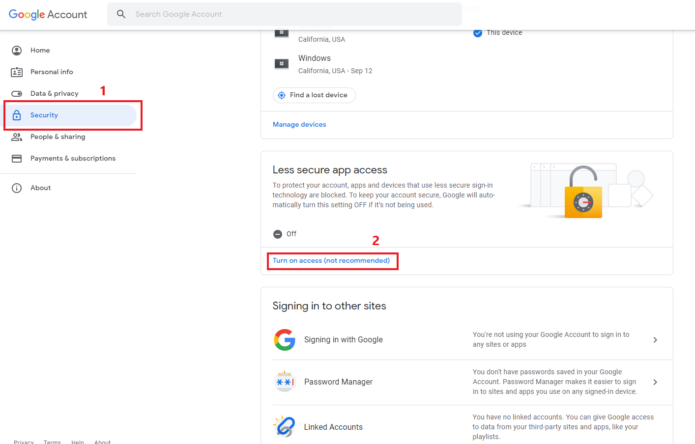

         Then confirm the option.
         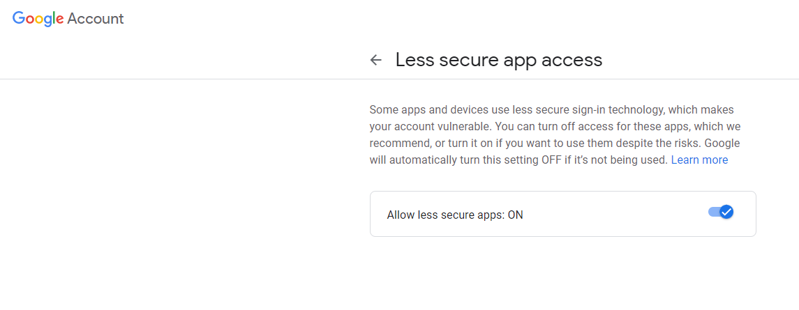

         Next, we need to turn on IMAP access. Navigate to See All Settings by select the tool icon on homepage.
         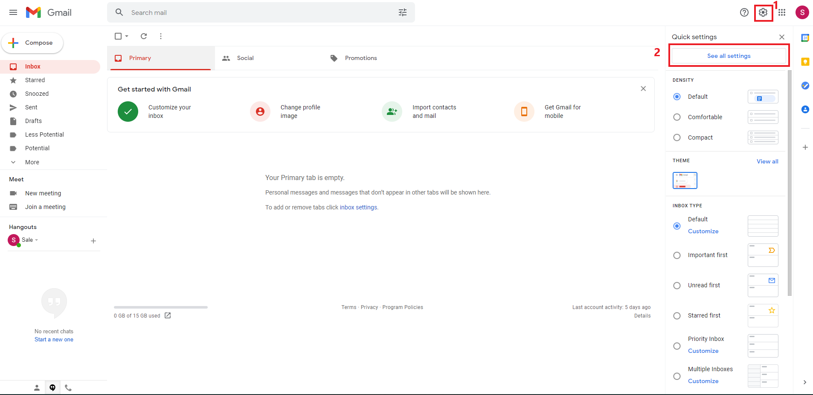
      
         In Settings page. Navigate to Forwarding and POP/IMAP tab on the ribbon. Select enable IMAP option in IMAP access section and save changes.
         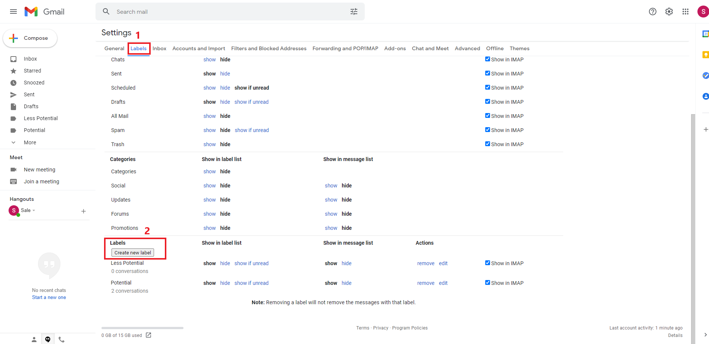
      
      2. **Setup Labels and filters in Gmail:**

         To create new labels, navigate to Labels tab in setting page and select Create new label
         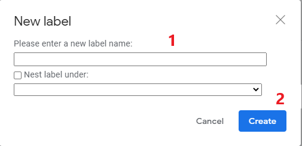

         Next, enter the new label name and click create.
         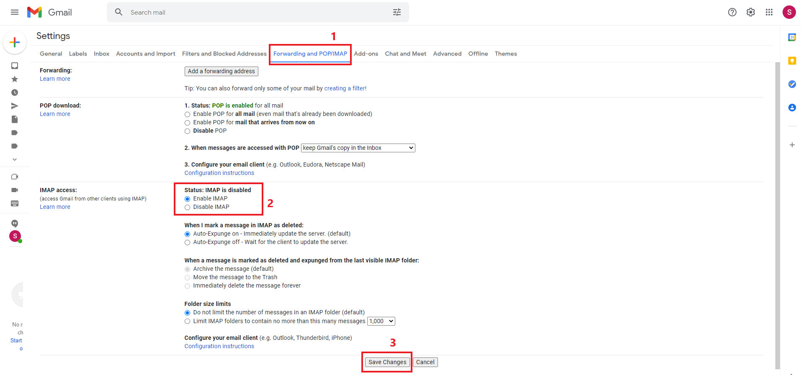
         
         In order to let Gmail automatically mark new incoming emails with an existing label, we can use filter feature in Gmail. On the mailbox page, click on the filter icon on the right side of search box. Fill in the From field with the email address that you want Gmail to automatically mark label on and then click Create Filter
         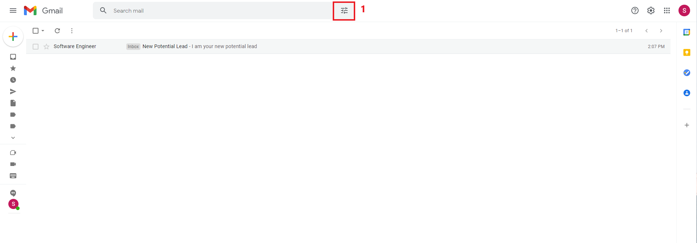
         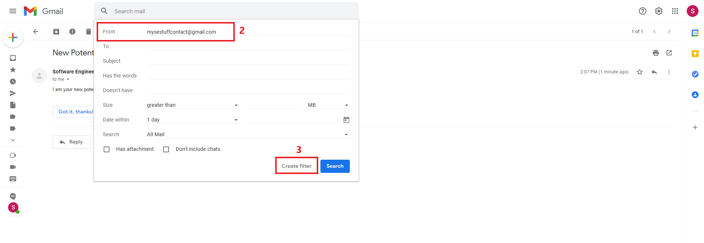

         Next, on the Apply to label option, select the label name that you want to apply specific label on for future incoming emails from the email address that you filled in From field earlier and click Create Filter again.
         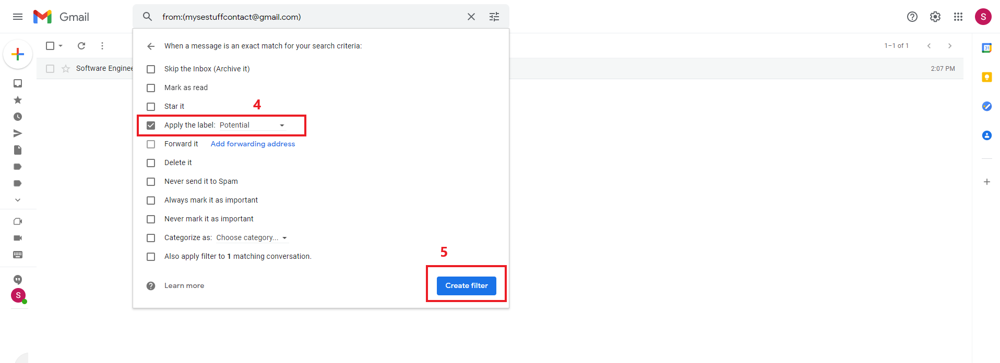

         Every time, if there is an email sent from that email address, Gmail will automatically apply the associated label on it.
   
   2. **Configuration in Odoo:**
      1. **Configuration in Incoming Email Server:**

         To configurate incoming email server, in Odoo, navigate to setting app and scroll down to External email Servers, enable the option, add Email alias as gmail.com (or novobi.com) and click save.
         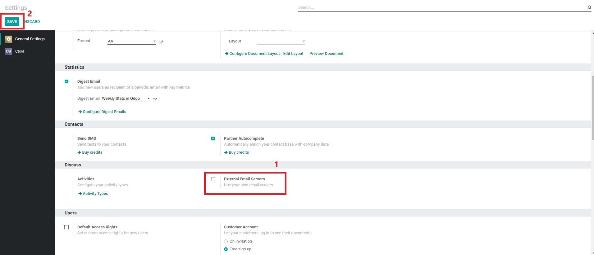

         After selecting option has been saved, scroll down to that section again and click on Incoming Email Servers
         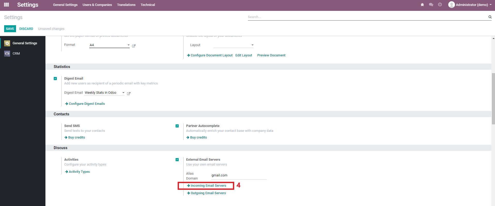
         
         In incoming email server section, click create to create a new incoming email server.
         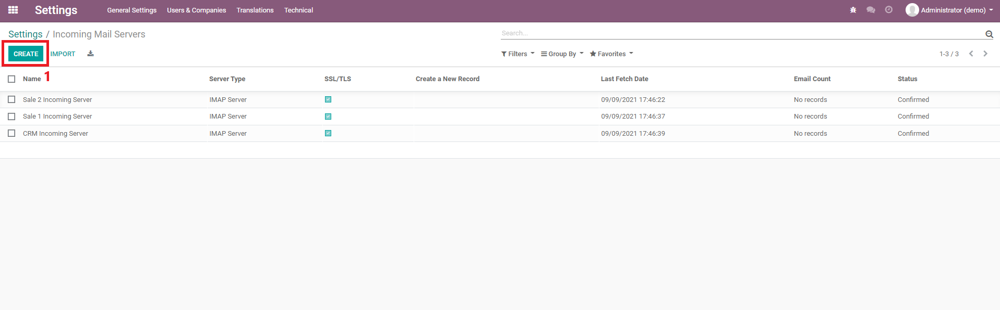

         In incoming email server form:
            - Name your server
            - Select the server type is IMAP Server
            - Fill in the Server Information:
                - Server Name: imap.gmail.com
                - Port: 993
                - Select SSL/TLS
                - Select Email Status Restore if you want Odoo to restore you incoming emails&#39; status
                - Input the Email Alias for forwarding email to Odoo (can be a fake address). This should be the same with Email Alias in CRM setting
                - Input Email Labels separate labels with commas
            - Fill in the Login information with your email information:
                - Username: your personal email address
                - Password: your email password
            - Click on test and confirm
      
         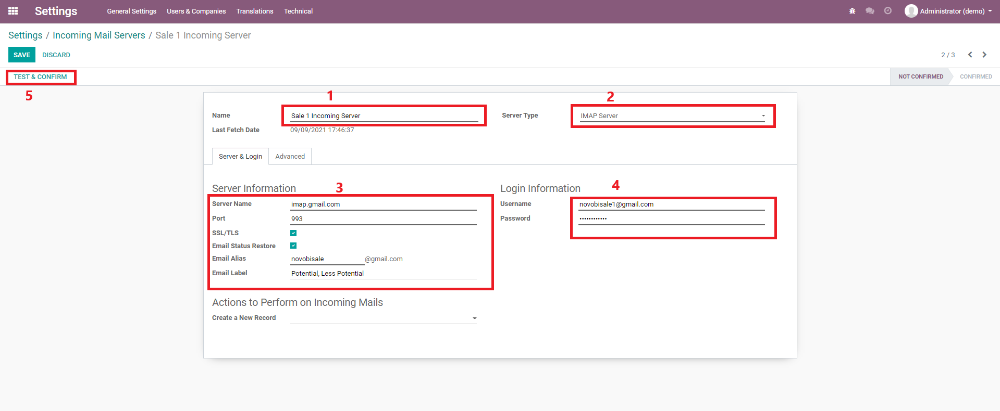

         Once the email has been successfully confirmed, click save to save all settings
         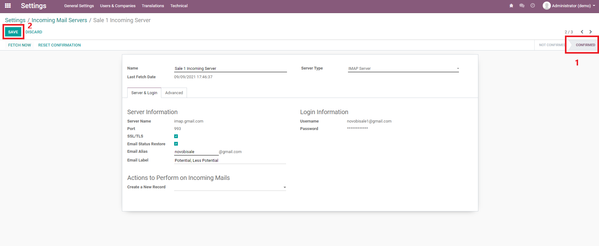
   
      2. **Configuration in CRM application:**

         In CRM application, select Configuration on the ribbon and choose Sale Teams
         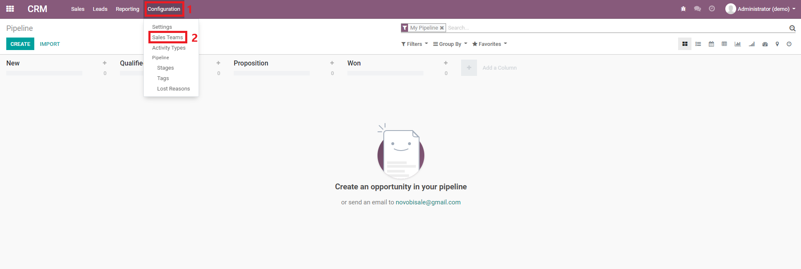

         Click Create to create a new sale team
         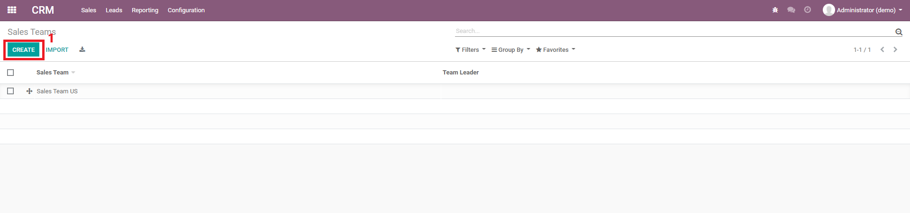

         Enter name team, select Lead generation option, fill in the Email Alias which associates with the Email Alias we defined earlier (in Incoming Email Server configuration), select assignee (optional), add sale team members (optional) and then click save
         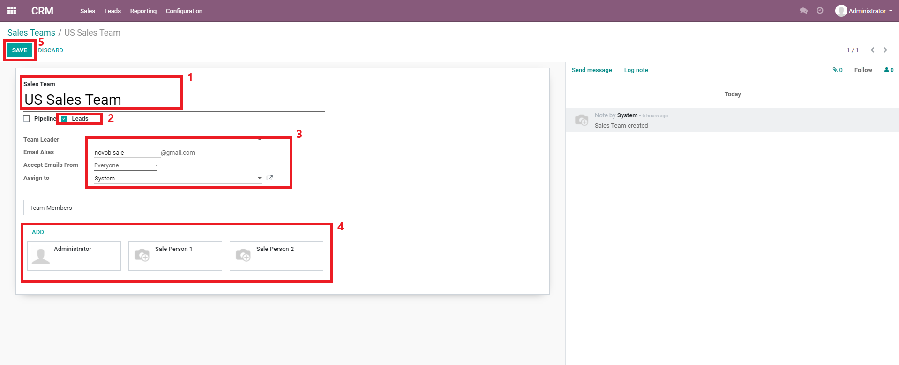

4. **Test cases:**

To perform test scenarios, you can use fetch now button in Incoming Email Server. Fetch now will fetch emails which associated with email information you provided in email server setting and illustrate the result in CRM app (in lead section)

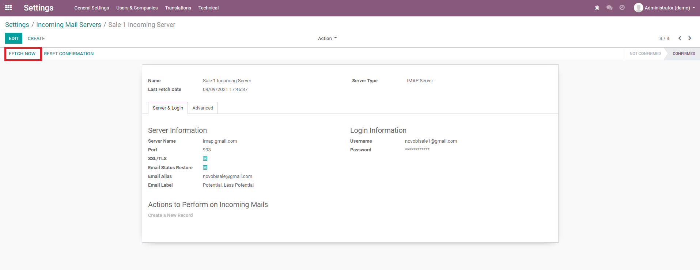
Some test scenarios include:

**General:**
1. Keep original emails status except for Novobi-CRM sale email
2. Fetch mails in multiple servers
3. Only fetch labeled emails

**Incoming Emails:**
1. Same conversations with same email address (reply)
2. Different conversations with same email address
3. Same address send to multiple servers

**Sending Emails:**

1. Sent multiple messages in one conversation (reply)
2. Sent multiple messages in different conversations
3. Multiple servers sent to the same email address
4. Sent email to a potential lead that is not in current database